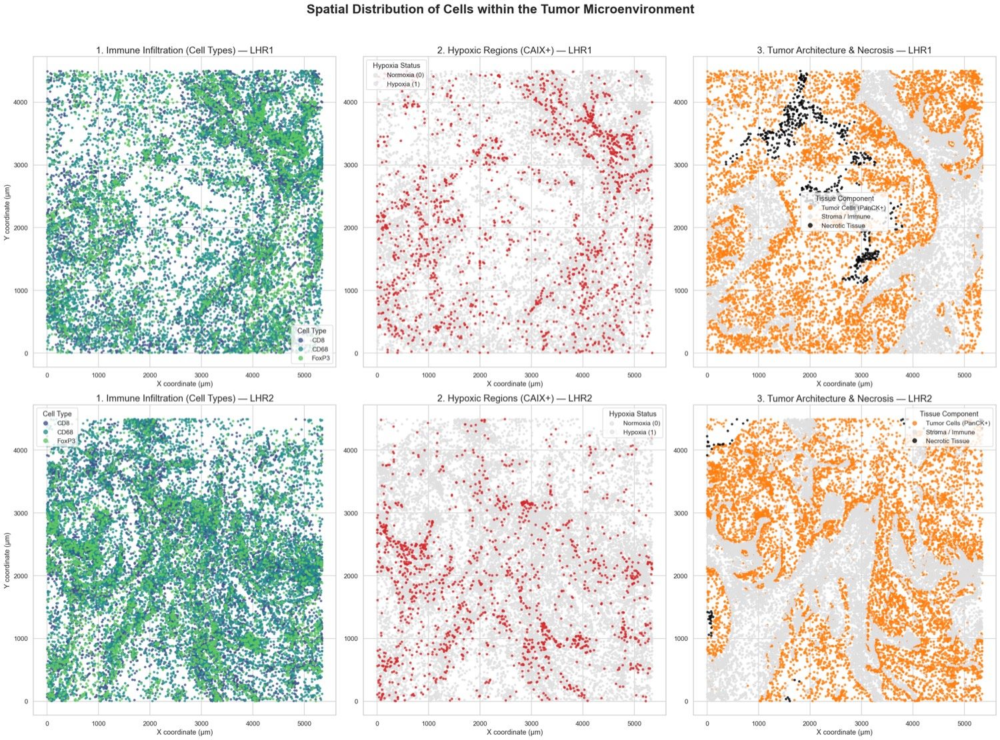
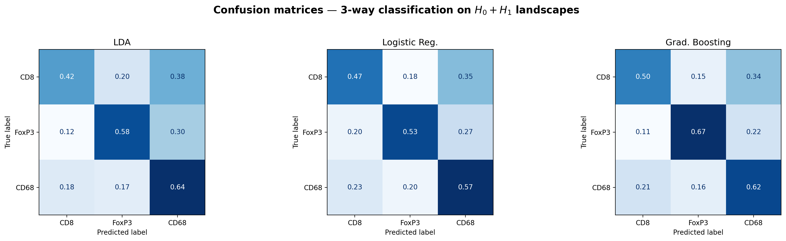

# Topological Classification of Immune Cell Spatial Patterns in the Tumor Microenvironment

Applied Statistics Project 2025–2026 — **ENSAE Paris**, Institut Polytechnique de Paris,
in collaboration with the **Max Planck Institute of Biochemistry** (Martinsried, Germany).

Emmanuel Akoun · Tom Bourdareau · Aaron Haddad · Baptiste Leloup
Supervisor: Dr. Juliette Murris

📄 **[Full report (30 pages, PDF)](report/topological_classification_immune_cells.pdf)**

---

## Problem

Solid tumors are ecosystems in which the *spatial arrangement* of immune cells influences
disease progression and prognosis. In head and neck squamous cell carcinoma (HNSCC), cytotoxic
T cells (**CD8**), macrophages (**CD68**) and regulatory T cells (**FoxP3**) shape the balance
between immune attack and immune evasion.

**Can these three cell types be told apart from the geometry of their point clouds alone —
nothing but (x, y) coordinates?**

[Vipond et al. (2021)](https://doi.org/10.1073/pnas.2102166118) answer yes, reaching up to 87 %
pairwise accuracy with **multiparameter** persistent homology, using a codensity parameter as a
proxy for local cell density. What their paper does not isolate is *where that performance comes
from*. This project is a focused **ablation study** on the same data that supplies the two
missing baselines:

1. **one-parameter** persistent homology instead of multiparameter, and
2. explicit **coordinate-based geometric statistics** instead of topology.
3. 

## Data

Both datasets come from Vipond et al. (2021), derived from immunohistochemistry images of HNSCC
specimens. They are included in `data/`.

| Dataset | Content | Used for |
|---|---|---|
| **Large Hypoxic Regions** (`data/large_hypoxic_regions/`) | 2 large tissue regions. Per cell: coordinates (x, y), immune cell type, and binary markers for hypoxia (CAIX+), tumor cells (PanCK+) and necrosis | Exploratory analysis |
| **1.5 mm ROIs** (`data/roi_1_5mm/`) | Non-overlapping 1.5 mm × 1.5 mm regions of interest, one CSV per (cell type, ROI), coordinates only. **16 tumors**, labelled `T_A` … `T_P` | Classification and testing |

ROIs with fewer than 20 cells are discarded — such sparse point clouds carry no meaningful
topological signal. This leaves **530 CD8, 502 FoxP3 and 549 CD68 ROIs (1581 in total)**.



The large hypoxic regions show a concentric architecture: a necrotic core, a hypoxic belt rich
in FoxP3 cells, and a well-oxygenated periphery where CD8 and CD68 predominate. FoxP3 cells are
markedly more hypoxic (CAIX+) than the two other populations — consistent with the known biology
of regulatory T cell recruitment in hypoxic niches, and the motivation for looking at *shape*.

## Method

**Persistent homology.** Each ROI point cloud is filtered by an **Alpha complex** (`gudhi`),
tracking connected components (`H0`) and loops (`H1`). Alpha filtration values are squared radii,
so a square root restores Euclidean-scale birth/death coordinates.

**Vectorisation.** Diagrams are mapped into a Hilbert space via **persistence landscapes**
(10 depths, resolution 80) and **persistence images**, making standard multivariate statistics
applicable.

**Evaluation protocol** — the part that matters most, since several ROIs come from the same tumor:

- **Tumor-level `StratifiedGroupKFold`** (10 folds, grouped by tumor). Random ROI splits would
  leak tumor identity into the training set and inflate every number reported here.
- **Landscapes fitted train-side only.** The discretisation grid is fitted on the training fold,
  never on the full dataset.
- **Leave-one-tumor-out** as a robustness check on the effective sample size (N = 16 tumors).
- Gradient boosting hyperparameters chosen by the **1-standard-error rule** rather than by best
  mean CV accuracy: the default configuration overfits hard (train 98.7 % vs test 60.1 %, a
  +38.6 pt gap); the selected one (`n_estimators=50`, `max_depth=2`) reaches the same test
  accuracy with a +14.2 pt gap.

**Baseline.** 15 coordinate-based geometric statistics per ROI, computed after centring and
scaling each point cloud to unit RMS radius: spread and anisotropy (4), nearest-neighbour
distances (5), pairwise distances (5), convex hull area (1).

**Hypothesis testing.** Both tests operate on tumor-level *mean* landscape vectors and are
**paired within tumor**, since every tumor contributes ROIs of all three cell types:

- a sign-flip permutation test on the L2 distance between group mean landscapes;
- a paired within-tumor **MMD** test (RBF kernel) on the full distribution;
- a KS test on the L2 norms of tumor-level means.

Bonferroni correction over the 3 pairwise comparisons gives α\* = 0.0167.

## Results

### Classification (3-way, gradient boosting, tumor-level 10-fold CV)

| Features | Accuracy |
|---|---|
| `H0` landscapes | 51.5 % ± 11.9 % |
| `H1` landscapes | 59.9 % ± 10.0 % |
| `H0 + H1` landscapes | 60.7 % ± 10.1 % |
| **15 coordinate features** | **88.5 % ± 9.9 %** |
| `H0 + H1` landscapes + coordinates | 88.8 % ± 8.8 % |

Pairwise tasks, same protocol:

| Task | `H1` landscapes | Coordinate features |
|---|---|---|
| CD8 vs FoxP3 | 77.1 % ± 8.7 % | 92.2 % ± 6.3 % |
| CD8 vs CD68 | 66.6 % ± 11.5 % | 95.4 % ± 5.2 % |
| FoxP3 vs CD68 | 78.3 % ± 12.3 % | 91.5 % ± 7.3 % |

Leave-one-tumor-out confirms the ordering and the variance: coordinates 86.6 % ± 11.9 %,
`H0 + H1` landscapes 64.7 % ± 14.4 %.



### Statistical tests (tumor-level, paired, α\* = 0.0167)

| Comparison | Mean-landscape permutation | MMD² | MMD test | KS test |
|---|---|---|---|---|
| CD8 vs CD68 | p = 0.0001 ✅ | 0.1522 | p = 0.0116 ✅ | p = 0.2145 |
| CD68 vs FoxP3 | p = 0.0004 ✅ | 0.1804 | p = 0.0023 ✅ | p = 0.4263 |
| CD8 vs FoxP3 | p = 0.1153 | 0.1242 | p = 0.4468 | p = 0.7164 |

### What this says

1. **One-parameter persistent homology does capture real differences** between macrophages
   (CD68) and both T cell populations — significant under both tests, and classification well
   above chance.
2. **But it is outperformed by simple coordinate statistics** on this dataset, 88.5 % vs 60.7 %
   on the 3-way task. Adding landscapes on top of coordinates changes essentially nothing
   (88.8 %), so the topological features contribute little the geometry does not already carry.
3. **The two T cell populations are topologically indistinguishable at tumor level.** CD8 vs
   FoxP3 is separable above chance by a classifier (77.1 %) but neither test rejects at tumor
   level — the signal lives at ROI scale and is washed out by aggregation.

Taken together with the 87 % of Vipond et al., this is consistent with the codensity parameter —
not persistent homology per se — carrying much of their reported advantage.

## Limitations

- **N = 16 tumors.** Aggregating at tumor level to avoid pseudoreplication leaves a small
  effective sample: 10-fold grouped CV puts only 1–2 tumors in each test fold, which is why
  every standard deviation above is in the 5–15 pt range. The non-significant CD8 vs FoxP3
  result is most plausibly a power problem, not evidence of topological equivalence.
- **The coordinate baseline is not a clean control.** Nearest-neighbour distances, pairwise
  distance summaries and convex hull area remain indirectly sensitive to the number and local
  density of points, even after normalising each cloud to unit RMS radius. How much of the
  88.5 % is genuine geometry versus an implicit cell count is not resolved here.
- **The exploratory analysis of the large hypoxic regions uses the first 1500 cells** of each
  (cell type, region) pair for tractability. This truncation is deterministic and therefore
  sensitive to row order in the source files. The spatial maps use all cells.
- **One filtration parameter, two homological dimensions.** No codensity, no multiparameter
  persistence, no `H2`.
- No confidence intervals on the *differences* between feature sets, and no formal test that
  coordinates beat landscapes — the gap is large but is reported as a point estimate.

## Repository structure

```
├── data/
│   ├── large_hypoxic_regions/     # 2 annotated tissue regions
│   └── roi_1_5mm/{CD8,CD68,FoxP3} # 1618 ROI point clouds over 16 tumors
├── notebooks/
│   ├── 01_synthetic_validation.ipynb    # pipeline sanity checks on known topology
│   └── 02_tumor_microenvironment.ipynb  # the analysis
├── src/statapp_tda/
│   ├── config.py       # constants and paths
│   ├── data.py         # dataset loading
│   ├── synthetic.py    # circles, torus, Klein bottle, pure-noise control
│   ├── topology.py     # Alpha-complex persistence, landscape vectorisation
│   ├── features.py     # 15 coordinate-based baseline features
│   ├── evaluation.py   # tumor-level cross-validated classification
│   ├── statistics.py   # paired permutation, MMD and KS tests
│   └── plotting.py     # every figure
├── figures/            # figures used in this README
└── report/             # final report (PDF)
```

The notebooks hold exploration, narrative and plots; everything reusable lives in
`src/statapp_tda/`.

## Getting started

```bash
uv sync                       # installs dependencies and the package in editable mode
uv run jupyter lab            # then open notebooks/
```

Requires Python 3.13. Both notebooks are committed with their outputs, so the results can be
read without running anything. A full re-execution of `02_tumor_microenvironment.ipynb` takes
roughly 20 minutes — it computes 1581 Alpha complexes and 30 000 permutations.

## References

- Vipond, O. et al. (2021). *Multiparameter persistence landscapes identify immune cell spatial
  patterns in tumors.* PNAS 118(41). — source of the data and the benchmark
- Bubenik, P. (2015). *Statistical topological data analysis using persistence landscapes.* JMLR 16(1)
- Adams, H. et al. (2017). *Persistence images: a stable vector representation of persistent
  homology.* JMLR 18(8)
- Chazal, F. and Michel, B. (2021). *An introduction to topological data analysis.*
  Frontiers in Artificial Intelligence 4
- The GUDHI Project (2014). *GUDHI User and Reference Manual.* https://gudhi.inria.fr/

Full bibliography in the [report](report/topological_classification_immune_cells.pdf).
